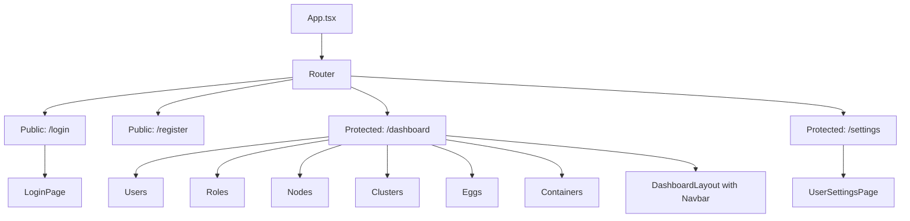
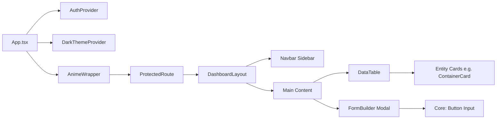

# Lormas Container Manager Frontend Architecture

## Overview
This document outlines the frontend architecture for the Lormas Container Manager, a modern dark mode UI with anime-style elements including smooth animations, neon gradients, and particle effects. The design leverages Tailwind CSS for styling, framer-motion for transitions, and custom CSS keyframes for advanced effects. The architecture emphasizes component reuse to maintain consistency and scalability, integrating seamlessly with the backend APIs for users/roles, nodes/clusters, eggs, and containers.

The frontend is built with Vite, React, TypeScript, and Tailwind. It reuses existing components like AuthProvider, LoginPage, DashboardLayout, and Navbar, while introducing new ones for data handling and entity management. All routes are protected where necessary, using React Router v7.

## Overall Structure

### Routes
The application uses React Router v7 for navigation. Routes are organized into public and protected sections:

- **Public Routes** (no authentication required):
  - `/login`: LoginPage for user authentication.
  - `/register`: Registration form (if self-registration is enabled via backend config).

- **Protected Routes** (require authentication via AuthProvider and ProtectedRoute):
  - `/dashboard`: Main entry point, renders DashboardLayout with sidebar navigation.
    - Sub-routes under `/dashboard`:
      - `/dashboard/users`: Users management page (list, CRUD).
      - `/dashboard/roles`: Roles management page (list, CRUD, assign to users).
      - `/dashboard/nodes`: Nodes management page (list, CRUD, assign tokens).
      - `/dashboard/clusters`: Clusters management page (list, CRUD, assign nodes).
      - `/dashboard/eggs`: Eggs management page (list, CRUD with JSON config editor).
      - `/dashboard/containers`: Containers management page (list, CRUD, lifecycle actions: start/stop/restart/logs, filters by ownership).
  - `/settings`: UserSettingsPage for personal settings (change email/password, link social accounts).

Error handling includes a 404 route and global error boundaries.

### Layout and Providers
- **Root Layout**: App.tsx wraps the entire app with:
  - `AuthProvider`: Handles authentication state and API calls via lib/auth.ts (using Better-Auth).
  - `DarkThemeProvider`: Manages dark mode toggle (default: dark), applying Tailwind's dark: prefix and custom CSS variables for neon gradients (e.g., `--neon-blue: linear-gradient(45deg, #00f5ff, #ff00ff)`).
  - `AnimeWrapper`: Global provider for framer-motion animations, enabling AnimatePresence for page transitions and lazy loading of particle effects.

- **DashboardLayout**: Sidebar navigation (Navbar) with anime-style hover effects (scale + glow). Main content area uses motion.div for fade-in/slide transitions.
- **Loading States**: LoadingPage with anime spinner (rotating neon particles via CSS keyframes).

Global styles in index.css include:
- Dark mode base: `bg-gray-900 text-white`.
- Anime effects: Keyframes for neon pulse (`@keyframes neonPulse { 0%, 100% { box-shadow: 0 0 5px #00f5ff; } 50% { box-shadow: 0 0 20px #00f5ff; } }`), particle backgrounds (CSS particles.js integration or custom divs with motion).

## Component Reuse Strategy
To maximize reuse and minimize boilerplate, components are categorized into core UI, data handling, and entity-specific. Existing components (e.g., Button, Input from Tailwind UI or custom) are extended with anime styles.

### Core Components (Reusable across all pages)
- **Button**: Variants for primary/secondary/danger (neon glow on hover via framer-motion hover scale 1.05 + CSS filter: drop-shadow).
- **Input**: Form inputs with focus animations (border neon glow, shake on error).
- **Modal**: Reusable dialog for CRUD operations (framer-motion for slide-in, backdrop blur).
- **Toast**: Notification system (e.g., react-hot-toast) with anime exit animations (fade + scale).

### Data Components (For lists and forms)
- **DataTable**: Generic table with pagination, search, sorting (integrates TanStack Table or AG-Grid). Columns configurable per entity (e.g., users: id, name, email, roles). Anime: Row hover lift effect, loading skeleton with shimmer.
- **FormBuilder**: Dynamic form generator for CRUD (uses react-hook-form + Zod for validation). Supports text, select, JSON editor (for eggs configs). For eggs, integrate Monaco Editor or react-json-view for interactive JSON config editing (e.g., validate schema for image, ports, volumes; provide autocomplete for common Docker options). Anime: Field focus transitions, success confetti particles.

### Entity-Specific Components (Minimal, wrap generics)
- **UserCard / RoleBadge / NodeStatus / ClusterOverview / EggPreview / ContainerCard**: Simple wrappers around Card component. Display key info (e.g., ContainerCard: status badge with color-coded anime pulse, logs snippet). Lifecycle buttons (start/stop) trigger Modals with FormBuilder.
- No heavy custom logic; rely on DataTable for lists and FormBuilder for edits.

All components use TypeScript interfaces from backend types (e.g., import { User, Container } from '../../backend/src/types').

## UI and Animation Integration
- **Dark Mode**: Enabled by default via DarkThemeProvider (localStorage persistence). Tailwind config extends with custom colors: `neon-blue: #00f5ff`, `neon-purple: #ff00ff`. Global CSS: `html { background: linear-gradient(135deg, #1a1a2e, #16213e); }`.
- **Anime Style**:
  - **Smooth Animations**: Framer-motion for all transitions (page enter: scale 0.95 -> 1 with spring, exit: fade out). Navbar items: whileHover={{ scale: 1.1, rotateY: 5 }}.
  - **Neon Gradients**: CSS custom properties applied to buttons/cards (background: linear-gradient(45deg, var(--neon-blue), var(--neon-purple))).
  - **Particle Effects**: Custom CSS for background particles (e.g., animated dots floating via @keyframes float { 0%, 100% { transform: translateY(0); } 50% { transform: translateY(-20px); } }). Integrate particles.js library for dashboard background if performance allows; otherwise, pure CSS divs with motion.
  - **Keyframes**: Define in globals.css, e.g., `@keyframes particleBurst { 0% { opacity: 1; transform: scale(0); } 100% { opacity: 0; transform: scale(1) translate(var(--dx), var(--dy)); } }` for action feedback (e.g., on container start).

Performance: Use lazy loading for heavy animations, throttle particles on mobile.

## Real-time Features
- **WebSocket Integration for Container Logs**: Use a custom hook `useContainerLogs` (built on WebSocket API or library like socket.io-client) to connect to backend endpoint `/api/ws/logs`. Authenticate with JWT from AuthProvider. Users can subscribe to specific container IDs (filtered by ownership permissions via backend guards).
  - **Subscription Flow**: On ContainerCard or DataTable load, connect WS and send { type: 'subscribe', containerId, userId }. Receive real-time log streams as { type: 'log', containerId, timestamp, message }.
  - **UI Updates**: Append logs to a scrollable LogViewer component (integrated in ContainerCard or Modal). Use framer-motion for smooth log entry animations (slide-in from bottom with neon highlight for errors/warnings).
  - **Anime Style**: New log lines fade in with particle burst on critical events (e.g., errors trigger red neon pulse + confetti). Auto-scroll with easing; pause on hover.
  - **Error Handling and Resilience**:
    - **Disconnections**: In `useContainerLogs` hook, detect close events (code 1006 for abnormal) and trigger auto-reconnect with exponential backoff (initial 1s, max 30s, up to 5 attempts). Show a Toast notification ("Connection lost, reconnecting...") with anime spinner.
    - **Authentication Errors**: On 401/403 (close code 1008), redirect to login or refresh token via AuthProvider; display "Session expired, please log in again."
    - **Network Errors**: Use navigator.onLine and ping the WS endpoint periodically; if offline, switch to offline mode (show cached logs from localStorage, last 100 lines) and sync on reconnect.
    - **Rate Limiting/Throttling**: If server sends throttle messages, reduce subscription frequency or pause updates with user warning ("Logs throttled due to high load").
    - **Graceful Degradation**: On persistent failures (after 3 reconnect attempts), fallback to polling REST API `/api/v1/containers/{id}/logs` every 10s. Log errors to console and optional Sentry integration for monitoring.
    - **Cleanup**: Unsubscribe on component unmount (send { type: 'unsubscribe', containerId }) to prevent ghost connections.
  - **Performance**: Limit log buffer to last 500 lines; use virtual scrolling for large logs in DataTable.

This enables live monitoring of container lifecycle actions (start/stop/logs) with engaging, real-time UI feedback.
## Diagrams

### Route Structure

### Component Hierarchy

## Implementation Notes
- **API Integration**: Use Axios or TanStack Query for API calls to /api/v1 endpoints (e.g., GET /users, POST /containers). Include auth headers from lib/auth.ts.
- **State Management**: React Context for global state (e.g., current user, theme); Zustand or Redux if needed for complex data like real-time container logs via WebSocket.
- **Backend WebSocket for Logs**: Extend the existing WebSocketManager in backend/src/libs/websocket.ts to handle client-facing connections at a new endpoint /api/ws/logs (authenticated via JWT from auth-middleware.ts). Implement a pub/sub mechanism (e.g., in-memory or Redis) to broadcast agent logs to subscribed frontend clients, filtered by user ownership and permissions (integrate permissions-guard.ts). Add a dedicated logs table to backend/src/database/schema.ts with the following schema:
  - `id`: UUID primary key (auto-generated).
  - `containerUuid`: Foreign key referencing containers.uuid (index for fast queries).
  - `timestamp`: DateTime (indexed with containerUuid for time-range queries).
  - `message`: Text (log content, up to 4096 chars).
  - `level`: Enum ['info', 'error', 'warn', 'debug'] (default 'info').
  - Optional: `nodeId`: Foreign key to nodes.id for multi-node tracing.
  - Indexes: Composite on (containerUuid, timestamp DESC) for recent logs; TTL policy to auto-delete logs older than 30 days.
  Run migration with drizzle-kit to create the table and relations. When agents send command_result with logs, batch-insert to DB (avoid duplicates via unique constraint if needed) and relay to subscribers via pub/sub. Provide a REST fallback: GET /api/v1/containers/{id}/logs (query params: limit=100, since=timestamp, level=filter; paginated with cursor) for initial loads or WS failures.
- **Dependencies**: Add framer-motion, react-router-dom@7, @headlessui/react (for modals), react-hook-form, zod.
- **Testing**: Unit tests for components (Vitest), E2E with Playwright focusing on animations.
- **Accessibility**: Ensure ARIA labels on animated elements, reduce motion for prefers-reduced-motion.

This architecture promotes reusability (80% shared components) while delivering an engaging anime-inspired UI.